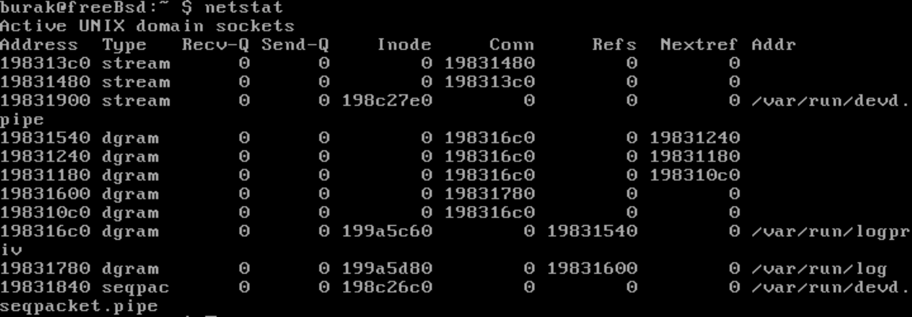
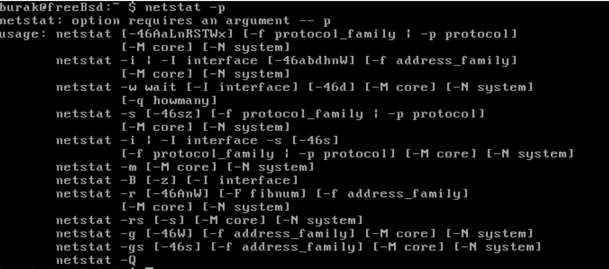
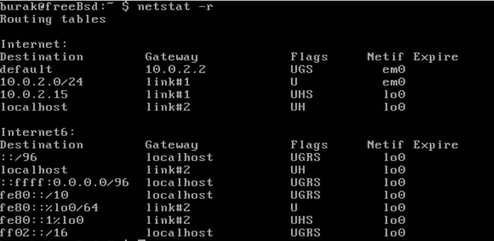
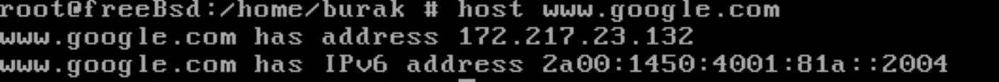
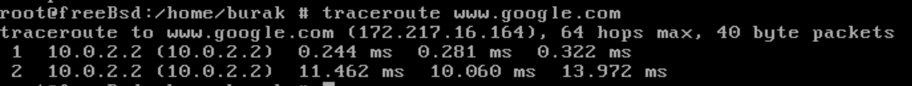

| TEMEL LINUX AĞ KOMUTLARI VE BİLGİLERİ |
|:----:|

- ping Komutu
    * İki düğüm arasındaki bağlantıyı test etmek için belirttiğiniz adrese paket istekleri gönderiri.
    ping IP/DNS şeklinde kullanılabilir. Örn: ping 4.2.2.2 ya da ping 192.168.xxx.xxx
    
+ netstat
    * Netstat komutu, açık soketler ve route tabloları dahil olmak üzere farklı bilgiler görüntüler. 
    Açık soketlerin listesini görmek için netstat komutunu çalıştırabilirsiniz. Netstat 
    komutunun birçok opsiyonu bulunmakta, man sayfası ile detayları öğrenebiliriz. 
    * Netstat -r parametresi ile çalıştırıldığında Route Tablosunu da görebiliyoruz.
    * -p parametresi ile de açık soketlere bağlı programların bilgisini görebiliyoruz.
    
    * Netstat Komutu
    
         
    
     * Netstat -p Komutu
     
           
    
     * Netstat -r Komutu
     
          
    

- tcpdump
    * Tcpdump paketleri bir ağ arayüzünden yakalar ve sizin için yorumlar. 
    Tüm paketleri daha sonra incelenmek üzere saklamak için kullanılabilir.

+ host
    * IPv4 veya IPv6'da alan adından IP bulma | IP'den website ismi bulma ve ayrıca DNS kayıtlarını 
    sorgulama komutudur. Bir etki (domain) alanı adı verin, ilgili IP adresini göreceksiniz. Bir 
    IP adresi verdiğinizde, ilişkili alan adını göreceksiniz.
    
      
   

- tracepath(on Linux/Debian etc) - traceroute(on FreeBSD)
    * Tracepath komutu, ağın sağladığınız hedefe giden yolu izler. Paketlerinizin belirli bir hedefe 
    giderken seyahat ettikleri ana bilgisayar serisini listelemeye çalışır. Bağlantı yolunuzdaki 
    süreleri listeleyerek yavaşlık noktalarını belirlemeye çalışırken çok kullanışlı olabilir.
    
        
    

+ ifconfig
    * ifconfig komutu IP Adresi, Donanım ve MAC adresini görüntülemek için kullanılır. Ayrıca ağ 
    arayüzlerini yapılandırmak için kullanılır. Arabirimleri etkinleştirmek veya devre dışı bırakmak, 
    arabirime IP Adresi atamak için kullanılabilir.
    
    - ifdown
    - ifup

- route
    Rota komutu, route tablosunu görüntülemek veya değiştirmek için kullanılan araçtır.

+ nslookup (FreeBSD 10 sürümünden sonra kaldırılmış.)
    * Bu komut, DNS ile ilgili sorguyu bulmak için kullanılır.

- dhclient
    * IP adresinizi serbest bırakmak (-r seçeneği) ve DHCP sunucunuzdan yeni bir tane almak için bu
    komutu kullanın.

+ whois (her zaman çalışır mı?)
    * Bu komut, alan adı(domain) adresi verilerek çalıştırılır. Bu adres ile ilgili isim, oluşturulma, 
    ait olduğu server gibi bütün bilgileri listeler.
    
- arp(FreeBSD ?)
    * Bu komut, çekirdeğin adres çözümleme protokolünün tablosunu görüntülemek ya da ekleme 
    yapabilmek için kullanılır.

+ ethtool
    * ethtool komutu mii-tool komutunun alternatifi diyebiliriz. Bu komut ile Ağ Arayüz Kartının 
    hızını ve dupleksini ayarlayabiilir ve görebiliriz.

- iwconfig
    * Bu komut kablosuz ağ arayüzünü ayarlamamıza yardımcı olur. Ayrıca basit Wi-Fi detaylarını 
    ve SSID kanal ve şifrelemelerini görebilir ve değiştirebiliriz.
    
+ hostname
    * Hostname bir ağda bilgisayarımızı tanımlamak içindir. Komutu çalıştırarak bilgisayarımızın 
    adını görebiliriz. Linux'ta /etc/sysconfig/network dizini içinde değişiklik yaparak bilgisayar 
    adımızı kalıcı olarak değiştirebiliriz.

- system-config-network
    * Linux'ta grafik arayüz kullanarak IP adresimizi, DNS ayarlarımızı ve ağa çıkma
    IP'mizi ayarlayabiliriz.
    

